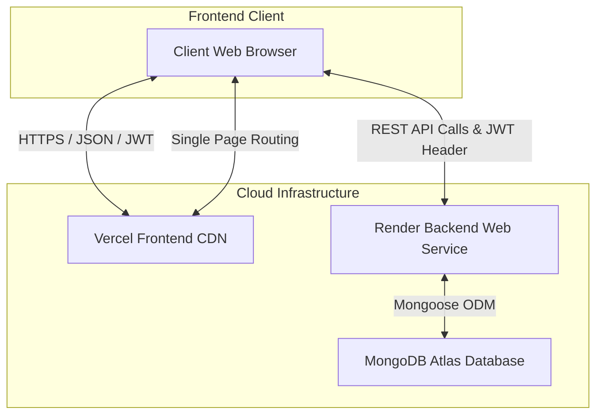
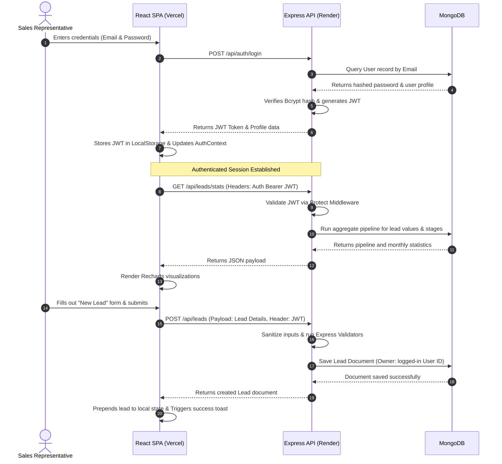

# Startup CRM Lite

<div align="center">
  
  <p><em>Empowering high-velocity startups to manage, track, and close deals effortlessly.</em></p>
</div>

---

### Badges
[](#technology-stack)
[](#technology-stack)
[](#license)
[](#deployment-guide)
[](#versioning-strategy)

---

## Table of Contents
1. [Project Overview](#project-overview)
2. [Problem Statement](#problem-statement)
3. [Vision & Objectives](#vision--objectives)
4. [Key Features](#key-features)
5. [Target Users](#target-users)
6. [Use Cases](#use-cases)
7. [Business Value](#business-value)
8. [Screenshots](#screenshots)
9. [Complete System Architecture](#complete-system-architecture)
10. [High-Level Architecture Overview](#high-level-architecture-overview)
11. [Application Workflow](#application-workflow)
12. [End-to-End User Flow](#end-to-end-user-flow)
13. [Technology Stack](#technology-stack)
14. [Project Folder Structure](#project-folder-structure)
15. [Explanation of Every Major Folder](#explanation-of-every-major-folder)
16. [Explanation of Every Important File](#explanation-of-every-important-file)
17. [Frontend Architecture](#frontend-architecture)
18. [Backend Architecture](#backend-architecture)
19. [Database Architecture](#database-architecture)
20. [API Overview](#api-overview)
21. [Authentication & Authorization](#authentication--authorization)
22. [State Management](#state-management)
23. [Storage Strategy](#storage-strategy)
24. [Third-Party Services & Integrations](#third-party-services--integrations)
25. [AI/Automation Components](#aiautomation-components)
26. [Development Prerequisites](#development-prerequisites)
27. [Installation Guide](#installation-guide)
28. [Environment Variables (`.env`) Documentation](#environment-variables-env-documentation)
29. [Project Configuration](#project-configuration)
30. [Running the Project (Development)](#running-the-project-development)
31. [Running the Project (Production)](#running-the-project-production)
32. [Build Process](#build-process)
33. [Deployment Guide](#deployment-guide)
34. [CI/CD Overview](#cicd-overview)
35. [Testing Strategy](#testing-strategy)
36. [Debugging Tips](#debugging-tips)
37. [Logging & Monitoring](#logging--monitoring)
38. [Security Considerations](#security-considerations)
39. [Performance Optimizations](#performance-optimizations)
40. [Coding Standards & Project Conventions](#coding-standards--project-conventions)
41. [Versioning Strategy](#versioning-strategy)
42. [Branching Strategy](#branching-strategy)
43. [Contribution Guidelines](#contribution-guidelines)
44. [Release Process](#release-process)
45. [Known Limitations](#known-limitations)
46. [Future Roadmap](#future-roadmap)
47. [Frequently Asked Questions (FAQ)](#frequently-asked-questions-faq)
48. [Troubleshooting Guide](#troubleshooting-guide)
49. [Changelog](#changelog)
50. [License](#license)
51. [Credits & Acknowledgements](#credits--acknowledgements)
52. [Contact Information](#contact-information)
53. [Final Project Summary](#final-project-summary)

---

## Project Overview
**Startup CRM Lite** is a lightweight, high-performance customer relationship management (CRM) platform designed specifically for fast-growing startups. Unlike bloated enterprise CRM solutions, Startup CRM Lite focuses on speed, clean user experience, and essential tracking capabilities: managing leads, analyzing pipeline health, and monitoring sales team performance. 

## Problem Statement
Startups need to manage leads and deals early in their lifecycle, yet enterprise tools like Salesforce or Hubspot are overly expensive, difficult to configure, and slow. Many startups default to spreadsheets, which lack real-time updates, security scopes, analytics, and workflow history. This leads to leaked pipelines, poor attribution mapping, and slower sales cycles.

## Vision & Objectives
Our vision is to build an open-source, self-hosted friendly, blazingly fast CRM that helps teams move from spreadsheets to active pipeline tracking in less than 5 minutes.
- **Simplicity:** Zero-training required onboarding.
- **Security:** Scoped data ownership where sales representatives view only their assigned leads.
- **Analytics-driven:** Real-time visibility into conversion funnels, monthly revenue forecasts, and pipeline velocities.

## Key Features
- **Secure Authentication:** JSON Web Token (JWT) based authentication.
- **Lead Pipeline Management:** Drag-and-drop-ready pipeline stages (`New`, `Contacted`, `Meeting Scheduled`, `Proposal Sent`, `Won`, `Lost`).
- **Interactive Analytics Dashboard:** Real-time charts covering revenue trends, lead source distributions, sales funnel conversion rates, sales velocity, and activity heatmaps.
- **CSV Data Import/Export:** Import existing lead spreadsheets or export CRM records cleanly.
- **Dynamic Search & Filters:** Multi-criteria lead filtering, text searching, and pagination.
- **Dark Mode Support:** Smooth light/dark theme transition persisted via LocalStorage.

## Target Users
- **Startup Founders:** To track overall revenue pipelines and team activity.
- **Sales Representatives:** To log leads, manage contacts, and track deal stages.
- **Sales Managers:** To analyze monthly revenue trends, evaluate high-performing representatives, and trace lead channels.

## Use Cases
1. **Spreadsheet Migration:** Importing a CSV of existing outbound targets and assigning statuses.
2. **Sales Review Meetings:** Pulling up the analytics dashboard to evaluate month-over-month deal velocity and revenue forecasts.
3. **Daily Lead Outreach:** Reps searching through their lead table, editing statuses, and logging transaction values.

## Business Value
- **Higher Conversion:** Keeps reps focused on high-value, stale leads.
- **Zero Configuration Overhead:** Run locally or deploy to free-tier cloud platforms in minutes.
- **Ownership Privacy:** Scoped access protects database integrity across multi-rep setups.

---

## Screenshots
*(Refer to the UI mockups or local running system for full visual representation)*
- **Dashboard Overview:** High-level KPIs showing Total Lead Value, Active Count, Conversion Rate, and Average Lead Age.
- **Leads Table & Kanban View:** A dynamic table with sorting, paging, and status badge dropdown updates.
- **Analytics Suite:** Visualization of source-performance, monthly trend progression, and sales velocity logs.

---

## Complete System Architecture

### High-Level Architecture Overview
The application follows a standard decoupled Client-Server architecture. The frontend application is a Single Page Application (SPA) built using React 19 and compiled via Vite, while the backend API is built using Node.js with the Express 5 framework and MongoDB.



---

## Application Workflow

### End-to-End User Flow
This sequence diagram details the interaction during login, retrieving dashboard statistics, and logging a new sales lead.



---

## Technology Stack
- **Frontend Core:** React 19.2.6 (SPA)
- **Frontend Compiler/Bundler:** Vite 8.0.12
- **Styling:** Tailwind CSS v4.0.0
- **Routing:** React Router Dom 7.17.0
- **Visualization:** Recharts 3.8.1 (Responsive charting)
- **Backend Framework:** Express 5.2.1
- **Runtime Environment:** Node.js (>=18.0.0)
- **Database Engine:** MongoDB (v7.4.0 compatible)
- **Object Data Modeling (ODM):** Mongoose 9.7.3
- **Security Middlewares:** Helmet (Header injection), Express Rate Limit, Express Mongo Sanitize
- **Request Clients:** Axios 1.18.1
- **Notifications:** React Hot Toast 2.6.0
- **Utilities:** Lucide React (Icons), Bcryptjs (Password hashing), Morgan (HTTP logger)

---

## Project Folder Structure

Below is the directory structure layout for the full-stack repository.

```
startup-crm-lite/
├── .env                     # Frontend production API endpoint
├── .gitignore               # System-wide file exclusions
├── add-dark-mode.cjs        # Tailwind v4 utility script for dark mode conversion
├── eslint.config.js         # Root ESLint validation rules
├── index.html               # Entry HTML for SPA
├── package.json             # Root monorepo-like script configurations
├── render.yaml              # Render.com blueprint deployment configurations
├── vercel.json              # Vercel SPA routing rewrites
├── vite.config.js           # Frontend Vite configurations
├── src/                     # Active React Frontend Directory
│   ├── main.jsx             # React bootloader and context setups
│   ├── App.jsx              # Main routing anchor and provider attachments
│   ├── assets/              # Graphics, logos, and global stylesheets
│   ├── components/          # Modular component elements
│   │   ├── analytics/       # Analytical cards and Recharts models
│   │   ├── common/          # Sidebar, layout components, and DarkModeToggle
│   │   ├── dashboard/       # Dashboard quick widgets and recent leads tables
│   │   └── leads/           # Leads forms, lists, tables, and status badges
│   ├── constants/           # Shared colors and UI lists
│   ├── context/             # Global contexts (Auth, Leads, Theme)
│   ├── hooks/               # Custom hooks (Analytics, LocalStorage)
│   ├── pages/               # Page router view targets
│   ├── services/            # Axios API wrappers (auth, leads)
│   └── utils/               # CSV exporters and math helpers
└── backend/                 # Backend Node/Express API Directory
    ├── server.js            # Server setup, middleware pipelines, database connection
    ├── .env                 # Backend private environment configurations
    ├── config/              # MongoDB database configuration helper
    ├── controllers/         # API business logic handlers
    ├── middleware/          # Security checkpoints and validation filters
    ├── models/              # Mongoose schema definitions (User, Lead)
    ├── routes/              # Express endpoint routers
    ├── utils/               # Custom API response utilities
    └── src/                 # WARNING: REDUNDANT/UNUSED FRONTEND DIRECTORY (DO NOT USE)
```

---

## Explanation of Every Major Folder

### `/src` (Active Frontend)
Contains all code related to the customer-facing user interface. It manages state, routes pages, draws charts, imports spreadsheets, and manages dark mode themes.

### `/backend` (Active Backend API)
Contains all code for the Node/Express server. It runs database schemas, processes JWTs, hashes secrets, filters injections, validates input formats, and aggregates collection metrics.

### `/backend/src` (Unused)
> [!WARNING]
> This folder is a redundant duplicated copy of the frontend source directories. It is **not** used or referenced by the backend Node API server. All edits to the web application interface must be conducted inside the root `/src` directory, not this folder.

### `/src/components`
Contains compartmentalized UI elements:
- `/analytics` maps data onto charts like Funnels, Revenue timelines, and Heatmaps.
- `/common` houses elements that repeat on multiple pages (the navigation `Sidebar`, global text search fields, and theme switchers).
- `/leads` builds forms to create/update records and formats grid layouts.

---

## Explanation of Every Important File

### [root/package.json](file:///c:/Users/ADMIN/.vscode/programs_vs_code/startup-crm-lite/package.json)
The primary driver configuration for scripts. It controls building and executing both the backend and frontend simultaneously in local development via `concurrently`.

### [backend/server.js](file:///c:/Users/ADMIN/.vscode/programs_vs_code/startup-crm-lite/backend/server.js)
The core backend application loader. It verifies environment setups, registers protection middlewares, establishes MongoDB database links, assigns routes, and implements graceful shutdown signals (`SIGINT`, `SIGTERM`).

### [src/context/AuthContext.jsx](file:///c:/Users/ADMIN/.vscode/programs_vs_code/startup-crm-lite/src/context/AuthContext.jsx)
Manages the global session lifecycle. Reads and saves JWT tokens to `LocalStorage`, queries logged-in credentials on page boot, and provides standard helper methods (`login`, `register`, `logout`) to nested elements.

### [add-dark-mode.cjs](file:///c:/Users/ADMIN/.vscode/programs_vs_code/startup-crm-lite/add-dark-mode.cjs)
A custom Node.js utility script designed to parse the `/src` tree and inject Tailwind dark mode variants dynamically to expedite dark mode styling.

---

## Frontend Architecture
The frontend is a component-driven Single Page Application built on **React 19** using **Vite**.
- **Rendering Strategy:** Client-Side Rendering (CSR). Code splitting is achieved via `React.lazy` and `Suspense` inside `src/routes/index.jsx` to optimize bundle delivery times.
- **Routing Engine:** Single page client navigation driven by `React Router Dom v7`.
- **Styling Pipeline:** Designed with Tailwind CSS v4, custom theme variables, and dynamic component styling.

---

## Backend Architecture
The backend is an API-only service utilizing **Express 5** to deliver high-performance endpoint executions.
- **Controller-Router Pattern:** Separates routes (interfaces) from business logic controllers.
- **Pipeline Middleware Pattern:** Routes first pass through input filters (validation, injection checking, authentication checking) before triggering database drivers.
- **Graceful Failures:** Implemented via a central error-handling middleware that parses standard errors and outputs uniform REST responses.

---

## Database Architecture
The database is a document-oriented structure powered by **MongoDB** via the **Mongoose ODM**.

### User Collection
Stores credentials and authorization configurations:
```javascript
{
  name: { type: String, required: true },
  username: { type: String, required: true, unique: true },
  mobile: { type: String, required: true },
  email: { type: String, required: true, unique: true },
  password: { type: String, required: true }, // Encrypted with Bcrypt
  role: { type: String, enum: ['admin', 'user'], default: 'user' },
  isActive: { type: Boolean, default: true }
}
```

### Lead Collection
Tracks client targets and revenue values:
```javascript
{
  name: { type: String, required: true },
  company: { type: String, required: true },
  email: { type: String, required: true },
  phone: { type: String },
  status: { type: String, enum: ['New', 'Contacted', 'Meeting Scheduled', 'Proposal Sent', 'Won', 'Lost'], default: 'New' },
  source: { type: String, enum: ['Website', 'Referral', 'LinkedIn', 'Cold Call', 'Email Campaign', 'Other'], default: 'Website' },
  notes: { type: String },
  value: { type: Number, default: 0 },
  wonAt: { type: Date },
  owner: { type: mongoose.Schema.Types.ObjectId, ref: 'User', required: true }
}
```

*Indexes:*
- `{ owner: 1, status: 1 }` (Optimizes user lead dashboard pipeline views).
- `{ email: 1 }` (Enforces indexing for duplicate target lookup checks).
- `{ owner: 1, createdAt: -1 }` (Speeds up listing page views).

---

## API Overview

### Authentication Routes (`/api/auth`)
| Method | Endpoint | Description | Auth Required |
|---|---|---|---|
| `POST` | `/register` | Register a new administrator/user account. | No |
| `POST` | `/login` | Authenticate credentials and return JWT. | No |
| `GET` | `/profile` | Fetch logged-in user details. | Yes |
| `PUT` | `/profile` | Update profile information. | Yes |
| `GET` | `/me` | Profile alias for frontend compatibility. | Yes |

### Lead Routes (`/api/leads`)
| Method | Endpoint | Description | Auth Required |
|---|---|---|---|
| `GET` | `/` | Fetch sorted, paginated leads (scoped to owner). | Yes |
| `POST` | `/` | Create a new lead record. | Yes |
| `GET` | `/stats` | Aggregate dashboard KPIs and conversion metrics. | Yes |
| `GET` | `/monthly-stats`| Retrieve 6-month monthly trends. | Yes |
| `GET` | `/search` | Lead autocomplete search. | Yes |
| `GET` | `/:id` | Fetch details of a single lead. | Yes |
| `PUT` | `/:id` | Overwrite lead fields. | Yes |
| `PATCH` | `/:id/status`| Quick status updates for pipelines. | Yes |
| `DELETE`| `/:id` | Remove a lead record. | Yes |

---

## Authentication & Authorization
- **Authentication:** Authenticated requests require a `Bearer <JWT>` token inside the HTTP `Authorization` header.
- **Authorization Scopes:**
  - `user`: Leads query results are strictly scoped to the authenticated user ID (`owner` field check). Users can only see or edit leads they created.
  - `admin` *(Future Roadmap)*: Full access to query across all users' collections.

---

## State Management
- **React Context:** App avoids prop-drilling by managing states globally inside contextual trees:
  - `AuthContext`: Manages login actions and user verification states.
  - `LeadContext`: Drives the lead table state and processes CRUD triggers.
  - `ThemeContext`: Toggles dark mode attributes on the root HTML tag.

---

## Storage Strategy
- **Client Storage:** Persists critical states on the client browser:
  - `crm-token` inside `LocalStorage` keeps sessions active across window reloads.
  - `startup_crm_theme` inside `LocalStorage` remembers UI light/dark preferences.
- **Database Storage:** All permanent objects are written to MongoDB collections.

---

## Third-Party Services & Integrations
- **MongoDB Atlas:** Managed multi-region database hosting.
- **Render.com:** Cloud platform hosting for Node.js API instances.
- **Vercel:** Hosting for React static assets with global Edge cache.

---

## AI/Automation Components
- *None currently implemented.* See [Future Roadmap](#future-roadmap) for details on planned AI enhancements.

---

## Development Prerequisites
- **Runtime:** Node.js version 18.0.0 or higher.
- **Database:** Access to a MongoDB Atlas cluster, or a local MongoDB database instance running on port `27017`.
- **Node Package Manager:** NPM (v9+ recommended).

---

## Installation Guide

1. Clone the repository to your local system:
   ```bash
   git clone https://github.com/charithasree13/startup-crm-lite.git
   cd startup-crm-lite
   ```
2. Install dependencies for the frontend application at the root directory:
   ```bash
   npm install
   ```
3. Install dependencies for the backend API:
   ```bash
   cd backend
   npm install
   cd ..
   ```

---

## Environment Variables (`.env`) Documentation

### Root Frontend Directory (`/.env`)
Create an `.env` file in the root workspace folder to configure the frontend target API.
```env
VITE_API_URL=http://localhost:5000
```

### Backend Directory (`/backend/.env`)
Create an `.env` file inside the `/backend` folder to configure database credentials and encryption keys.
```env
PORT=5000
MONGODB_URI=mongodb://localhost:27017/startup-crm-lite
JWT_SECRET=your_jwt_signing_key_secret_string
JWT_EXPIRES_IN=7d
NODE_ENV=development
FRONTEND_URL=http://localhost:5173
```

---

## Project Configuration
- **Vite:** Set up in `vite.config.js` to process React components and load Tailwind CSS plugins.
- **ESLint:** Code linter configurations defined in `eslint.config.js` to maintain code consistency.

---

## Running the Project (Development)

Run both the frontend client and the backend server concurrently with a single command from the project root:
```bash
npm run dev:full
```
- **Frontend** compiles at: `http://localhost:5173`
- **Backend API** runs at: `http://localhost:5000`

---

## Running the Project (Production)

To simulate production environments locally:
1. Build the frontend client:
   ```bash
   npm run build
   ```
2. Start the backend Node server directly:
   ```bash
   npm start
   ```

---

## Build Process
To compile the frontend SPA for production deployment:
```bash
npm run build
```
This generates optimized HTML, CSS, and JS chunks in the `/dist` directory. The backend API is purely Node.js and requires no compilation step.

---

## Deployment Guide

### Backend (Render.com)
The backend uses a Web Service structure configured inside the root [render.yaml](file:///c:/Users/ADMIN/.vscode/programs_vs_code/startup-crm-lite/render.yaml) file.
1. Create a new service from your Render dashboard linked to the repository.
2. Render automatically reads the blueprint setup:
   - **Root Directory:** `backend`
   - **Build Command:** `npm install`
   - **Start Command:** `npm start`
3. Configure the environment variables (`MONGODB_URI`, `JWT_SECRET`, `FRONTEND_URL`) within Render's dashboard.

### Frontend (Vercel)
1. Link your repository inside your Vercel Dashboard.
2. Select the project root directory.
3. Configure Vercel settings:
   - **Build Command:** `npm run build`
   - **Output Directory:** `dist`
4. Define the Environment Variable: `VITE_API_URL` pointing to your Render backend API.
5. Vercel will read [vercel.json](file:///c:/Users/ADMIN/.vscode/programs_vs_code/startup-crm-lite/vercel.json) to handle routing rewrites correctly.

---

## CI/CD Overview
Currently, the pipeline uses Git-integrations with Render and Vercel. Committing code updates directly to the `main` branch triggers an automated build and hot-reload deployment on the hosting platforms.

---

## Testing Strategy
- **Manual Verification:** Test routes, API responses, CRUD actions, and CSV imports manually.
- **Future Integration:** Setup for Jest and React Testing Library is planned to build automated validation checkpoints for routers, validation middlewares, and helper functions.

---

## Debugging Tips
- **Network Inspections:** Inspect the Network tab in browser developer tools to verify JWT headers (`Authorization: Bearer <token>`) are attached to outbound API calls.
- **Backend Logs:** Check console logs from `nodemon` or standard output. `morgan` outputs formatted HTTP logs for every inbound route request.

---

## Logging & Monitoring
- **Development Logs:** `morgan` runs in `dev` mode to print colorized status logs to the console.
- **Production Logs:** `morgan` outputs formatted `combined` requests logs for standard parsing utilities.

---

## Security Considerations
1. **MongoDB Query Injections:** Custom query sanitization middleware in `server.js` strips MongoDB symbols (`$`, `.`) from request inputs to protect against database injections.
2. **Brute Force Protection:** IP rate-limiting applies via `express-rate-limit`:
   - General endpoints: Max 100 requests per 15 minutes.
   - Authentication endpoints: Max 100 registration/login attempts per 15 minutes.
3. **HTTP Header Protections:** Integrated `helmet` to apply secure default HTTP headers.
4. **Data Sanitization:** Strict Request size parser limits (capped at `10kb`) protect endpoints against DOS attacks.

---

## Performance Optimizations
- **Database Indexing:** Compound indexes on critical query paths (e.g., owner-status checks) ensure quick search queries.
- **Lazy Loading:** UI routing splits chunks using `Suspense` and `lazy` loading to minimize initial page download sizes.
- **Tailwind v4:** Uses CSS variables instead of bloated configuration engines, accelerating render speeds.

---

## Coding Standards & Project Conventions
- **Naming Conventions:**
  - Files & Folders: camelCase (utilities/hooks) or PascalCase (React components).
  - Backend controllers/routes: camelCase files (`authRoutes.js`, `leadController.js`).
- **Standard ESLint rules:** Integrated in the root directories. Use standard ES6 syntax, imports, and hooks.

---

## Versioning Strategy
We adhere to **Semantic Versioning (SemVer)**:
- **Major (`1.x.x`):** Non-backward-compatible API changes.
- **Minor (`x.1.x`):** Backward-compatible feature updates.
- **Patch (`x.x.1`):** Bug fixes and performance adjustments.

---

## Branching Strategy
We recommend a simplified Git Flow branching strategy:
- `main` represents production-ready releases.
- `develop` tracks integrated active updates.
- `feature/...` branches are created for isolated feature changes and merged via Pull Requests.

---

## Contribution Guidelines
1. Fork the project repository.
2. Create your feature branch (`git checkout -b feature/AmazingFeature`).
3. Commit your changes (`git commit -m 'Add some AmazingFeature'`).
4. Push to the branch (`git push origin feature/AmazingFeature`).
5. Open a Pull Request.

---

## Release Process
1. Finalize features on the `develop` branch.
2. Merge `develop` into `main` using a release pull request.
3. Apply a Git version tag (`git tag -a v1.0.0 -m "Release version 1.0.0"`).
4. Push tags (`git push origin --tags`) to trigger the release cycle.

---

## Known Limitations
- **Data Encapsulation:** Lead scopes are currently constrained by Owner IDs, but there is no native tenant segregation if hosted in multi-org business settings.
- **Bulk Operations:** Large CSV imports run sequential DB insertions which can be slow for datasets over 5,000 records.

---

## Future Roadmap
- [ ] Add support for automated multi-role organizational hierarchy (admin, sales rep, read-only analyst).
- [ ] Implement robust automated test suites using Vitest and Cypress.
- [ ] **AI Leads Scorer:** Auto-rank leads based on transaction values, history logs, and attribution sources.
- [ ] Support pipeline drag-and-drop kanban boards.

---

## Frequently Asked Questions (FAQ)

#### Q: How do I change the backend port?
A: Edit the `PORT` variable inside your `/backend/.env` file.

#### Q: Why does the app redirect me to the login page repeatedly?
A: This occurs if your JWT token expires or is invalid. The Axios interceptor receives a `401 Unauthorized` status and redirects the browser to clear expired states.

---

## Troubleshooting Guide

#### Problem: React App cannot connect to the backend server.
- **Verify:** Ensure `VITE_API_URL` matches the active server URI (including the port).
- **CORS block:** Ensure the address of your frontend client is listed in the `allowedOrigins` array in `backend/server.js` or configured correctly in the backend `.env`.

#### Problem: Local MongoDB database connection failures.
- **Check:** Ensure the MongoDB local daemon is running (`mongod` command) or verify your MongoDB Atlas connection string.

---

## Changelog
### [1.0.0] - 2026-07-17
- Initial release of Startup CRM Lite.
- Implemented full lead CRUD operations.
- Added Recharts analytical widgets.
- Implemented JWT authentication and custom injection protections.

---

## License
Distributed under the **MIT License**. See `LICENSE` for more information.

---

## Credits & Acknowledgements
- Icons powered by [Lucide React](https://lucide.dev).
- Charts built with [Recharts](https://recharts.org).
- Database interface managed via [Mongoose](https://mongoosejs.com).

---

## Contact Information
- **Project Lead:** Charithasree ([GitHub Profile](https://github.com/charithasree13))
- **Repository Link:** [startup-crm-lite](https://github.com/charithasree13/startup-crm-lite)

---

## Final Project Summary
**Startup CRM Lite** bridges the gap between chaotic spreadsheets and complex enterprise CRM tools. By combining a clean React 19 UI with a secure Express 5/MongoDB backend, it gives startups a free, fast, and secure database platform to control their deal flows and accelerate business growth.
